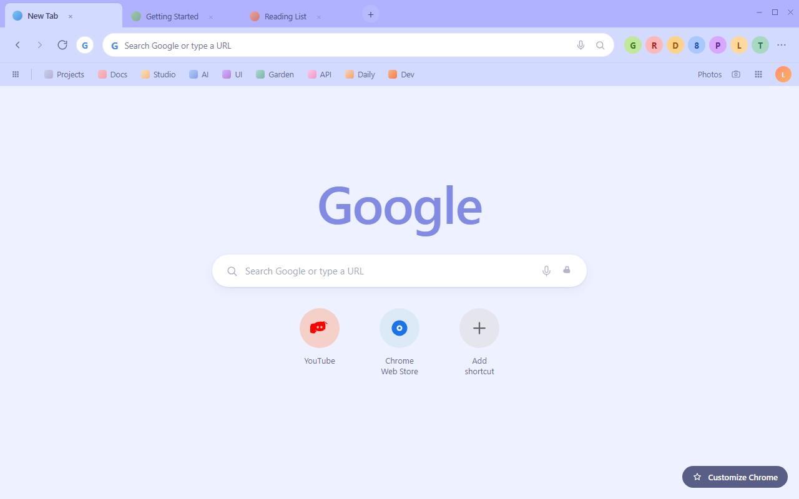
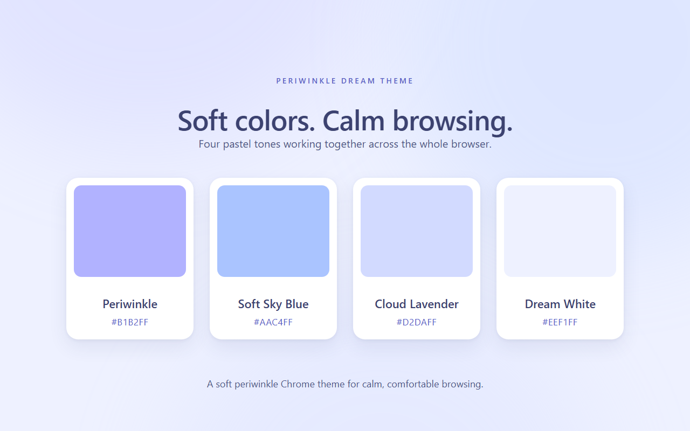
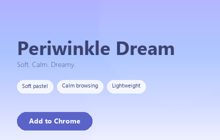
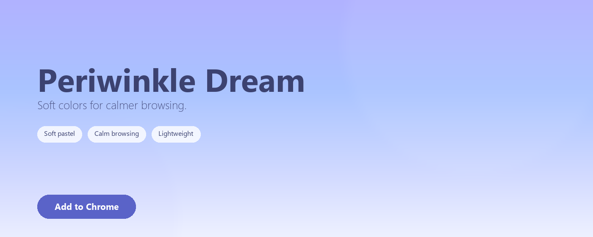

# Periwinkle Dream Theme

<p align="center">
  
</p>

<p align="center">
  A soft and dreamy Chrome theme inspired by periwinkle skies, lavender clouds, and calm pastel tones.
</p>

## Contents

- [Preview](#preview)
- [Overview](#overview)
- [Color Palette](#color-palette)
- [Features](#features)
- [Installation](#installation)
- [Regenerating Store Assets](#regenerating-store-assets)
- [Quality Checks](#quality-checks)
- [File Structure](#file-structure)
- [Privacy](#privacy)
- [License](#license)

## Preview

### Browser with the theme applied



### The four palette tones



### Promo tiles

| Small promo (440x280) | Marquee promo (1400x560) |
|:---:|:---:|
|  |  |

## Overview

Periwinkle Dream Theme wraps Chrome in a quiet lavender-blue palette built for everyday use. The frame sits in gentle periwinkle, the toolbar and active tab stay in cloud lavender, and the new tab page settles on dream white. Instead of separate colored blocks, the window reads as one soft gradient from periwinkle down to white.

The palette was tuned for long sessions. Active tabs are clearly brighter than inactive ones, and text, icons, and bookmarks all use a deep periwinkle ink that stays readable on the pale surfaces. Nothing is high-saturation, nothing is neon, and there are no heavy dark panels.

## Color Palette

The four core colors come straight from `manifest.json`.

| Color | Hex | RGB | Role in the theme |
|-------|-----|-----|-------------------|
| Periwinkle | `#B1B2FF` | 177, 178, 255 | Active window frame, inactive tab text background, accent |
| Soft Sky Blue | `#AAC4FF` | 170, 196, 255 | Inactive window frame, secondary surfaces |
| Cloud Lavender | `#D2DAFF` | 210, 218, 255 | Toolbar, active tab, bookmarks bar |
| Dream White | `#EEF1FF` | 238, 241, 255 | New tab background, omnibox background |

Three derived tones support readability. No pure black is used anywhere; the darkest value is a deep periwinkle ink.

| Color | Hex | RGB | Role |
|-------|-----|-----|------|
| Deep Periwinkle Ink | `#3C4270` | 60, 66, 112 | Active tab, bookmark, toolbar icon, and omnibox text |
| Muted Periwinkle Ink | `#404676` | 64, 70, 118 | Inactive tab text |
| Soft Periwinkle Ink | `#464C7E` | 70, 76, 126 | Inactive-window tab text |
| Periwinkle Link | `#5A63C8` | 90, 99, 200 | New tab page links and accent |

### Where each color is applied

| Manifest key | Value | Result in Chrome |
|--------------|-------|------------------|
| `frame` | `#B1B2FF` | Active window tab strip, so inactive tabs sit on periwinkle |
| `frame_inactive` | `#AAC4FF` | Tab strip when the window loses focus |
| `toolbar` | `#D2DAFF` | Toolbar, active tab, and bookmarks bar |
| `tab_text` | `#3C4270` | Active tab label |
| `tab_background_text` | `#404676` | Inactive tab labels |
| `tab_background_text_inactive` | `#464C7E` | Inactive tab labels in an unfocused window |
| `bookmark_text` | `#3C4270` | Bookmark bar labels |
| `toolbar_button_icon` | `#3C4270` | Back, forward, reload, and extension icons |
| `button_background` | `#B1B2FF` | Toolbar button surfaces and accent |
| `omnibox_background` | `#EEF1FF` | Address bar field |
| `omnibox_text` | `#3C4270` | Address bar text |
| `ntp_background` | `#EEF1FF` | New tab page background |
| `ntp_text` | `#3C4270` | New tab page text |
| `ntp_link` | `#5A63C8` | New tab page links |

The active tab is `#D2DAFF` against inactive tabs at `#B1B2FF`, which is a clear step in lightness rather than a subtle tint, so the active tab is easy to find.

Every text and surface pair clears WCAG AA (4.5:1). Measured ratios are 6.9:1 for active tab, bookmark, and toolbar text, 8.5:1 for omnibox and new tab text, 4.6:1 for new tab links, and 4.5:1 and 4.6:1 for the two inactive tab states.

### Tints

`tints` values are set to the exact HSL of the colors they cover, so they reinforce the palette instead of shifting it. A Chrome tint replaces the hue, saturation, and lightness of the surface it applies to, so a tint that disagrees with its color would silently change what the browser renders and desynchronize it from the store screenshots. `scripts/verify-assets.py` fails the build if a tint ever drifts from its color.

## Features

- Soft periwinkle color palette
- Dreamy lavender-blue aesthetic
- Clean and distraction-free interface
- Carefully balanced tab contrast
- Comfortable for everyday browsing
- Lightweight Chrome theme
- No tracking or unnecessary permissions

## Installation

### From the Chrome Web Store

1. Open the Chrome Web Store listing for Periwinkle Dream Theme.
2. Click **Add to Chrome** and confirm when prompted.
3. The theme applies instantly, with no restart required.

### Load unpacked (local testing)

1. Download or clone this repository to a folder on your computer.
2. Open `chrome://extensions` in Chrome.
3. Enable **Developer mode** using the toggle in the top-right corner.
4. Click **Load unpacked** in the top-left corner.
5. Select this project folder (`periwinkle-dream-theme`).
6. Periwinkle Dream Theme appears in the extension list and applies immediately.

To remove it, open `chrome://extensions` and click **Remove**, or choose a different theme in `chrome://settings/appearance`.

## Regenerating Store Assets

The store artwork is generated from `manifest.json`, so it can never drift away from the theme you actually install. Python 3 with Pillow and Playwright is required.

```bash
python scripts/generate-assets.py        # icon.png + assets/icon-source.png
python scripts/generate-screenshots.py   # 1280x800 store screenshots
python scripts/generate-promo.py         # 440x280 and 1400x560 promo tiles
python scripts/verify-assets.py          # size, mode, manifest, and contrast checks
python scripts/package.py                # build the store upload zip
```

On Windows, use the full path to your Python interpreter if `python` is not on `PATH`. Each generator asserts its own layout bounds, so a bad coordinate fails loudly instead of producing a broken image.

## Packaging for the Chrome Web Store

`scripts/package.py` builds `periwinkle-dream-theme-<version>.zip` with `manifest.json` at the **root** of the archive — Chrome Web Store rejects uploads where the manifest is nested inside a folder. The zip contains only the theme itself:

```
manifest.json
README.md
LICENSE
store-assets/icon.png
```

Screenshots and promo tiles are **not** included, because they are uploaded separately in the store listing form rather than as part of the extension. `scripts/`, `assets/`, and `store-listing.txt` are excluded for the same reason.

The script verifies its own output before reporting success: manifest v3 and version consistency, every manifest-referenced file present, `manifest.json` at the zip root, the manifest re-parsed from inside the archive, and a byte-identical copy in the projects folder two levels above the project root.

```bash
python scripts/package.py
```

## Quality Checks

`scripts/verify-assets.py` is a pre-publish gate. It exits non-zero if anything regresses, so it can be run before packaging or in CI:

```bash
python scripts/verify-assets.py
```

It checks:

- **Store asset dimensions and format** — screenshots at 1280x800 RGB, small promo at 440x280 RGB, marquee at 1400x560 RGB, icon at 128x128 RGBA. Chrome Web Store rejects PNGs that carry an alpha channel for screenshots and promo tiles.
- **Manifest validity** — manifest v3, name under 45 characters, description under 132 characters, and no permissions, background, or content scripts declared.
- **Icon integrity** — all four corners fully transparent, and the plate stays inside the periwinkle color family.
- **Rendered color bands** — the dominant color of the tab strip, toolbar, bookmarks bar, and new tab page in the screenshot is compared against `manifest.json`, so the artwork can never drift from the installed theme.
- **Tint consistency** — each `tints` value must equal the HSL of the color it covers. A Chrome tint replaces hue, saturation, and lightness, so a mismatched tint would silently change the rendered palette.
- **Palette purity** — every theme-controlled pixel stays within the 195-285 degree blue/violet hue range, catching stray greens, reds, oranges, or neon tones.
- **English-only store copy** — no CJK characters in user-facing text.
- **No executable code** — no `.js` or `.html` files, and no permission keys in the manifest.
- **WCAG AA contrast** — every text and surface pair clears 4.5:1.

## File Structure

```
periwinkle-dream-theme/
├── manifest.json                   # Theme manifest and color definitions
├── assets/
│   └── icon-source.png             # 512x512 master icon artwork
├── scripts/
│   ├── generate-assets.py          # Icon generator
│   ├── generate-screenshots.py     # Headless browser store screenshots
│   ├── generate-promo.py           # Promo tile generator
│   ├── verify-assets.py            # Chrome Web Store requirement checks
│   └── package.py                  # Builds the store upload zip
├── store-assets/
│   ├── icon.png                    # 128x128 store icon
│   ├── periwinkle-dream-small-promo.png    # 440x280 small promo tile
│   ├── periwinkle-dream-marquee-promo.png  # 1400x560 marquee promo tile
│   ├── screenshots/en/             # Two 1280x800 store screenshots
│   └── store-listing.txt           # Store listing copy and keywords
├── LICENSE                         # Non-Commercial License
└── README.md                       # This file
```

## Privacy

Periwinkle Dream Theme is a pure theme. It contains no JavaScript, no background or content scripts, no analytics, and no remote code. It requests no permissions, collects no data, and never reads your browsing activity. The entire package is a single manifest file plus one icon.

## License

This theme is released under a **Non-Commercial License**. Free for personal use only. See [LICENSE](LICENSE) for details.

---

Made by [Li Lin Huang](https://www.linkedin.com/in/%E4%B8%BD%E9%9C%96-%E9%BB%84-7b7794373/)
